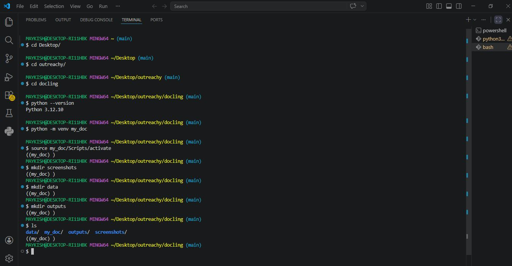
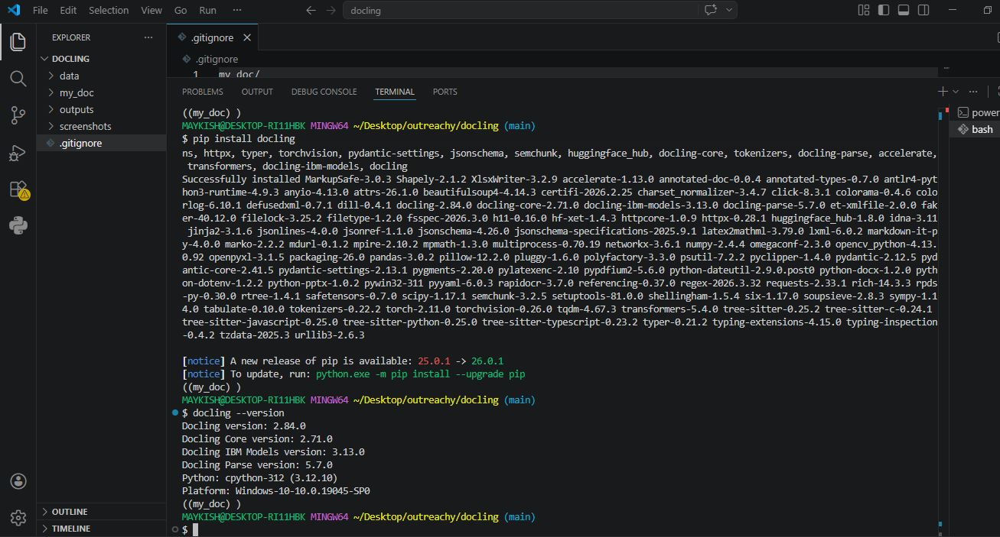
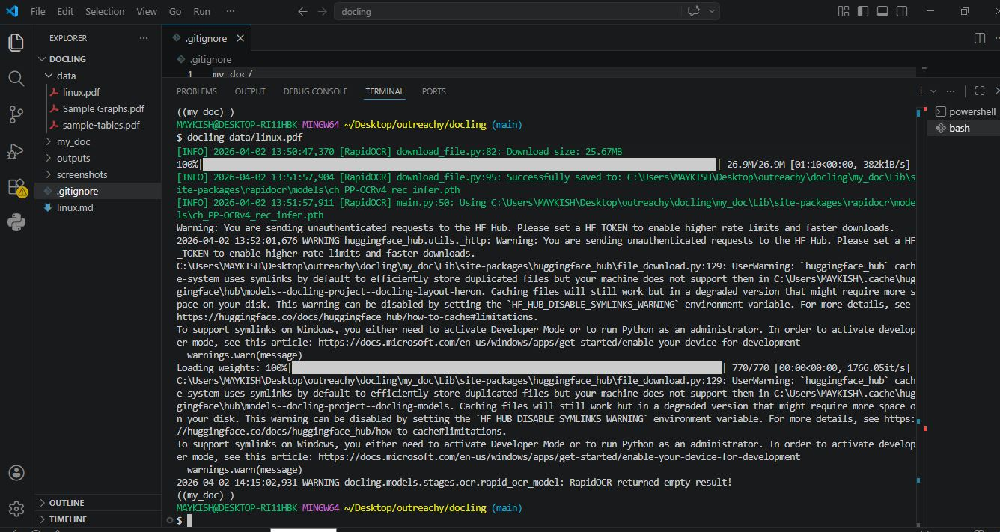
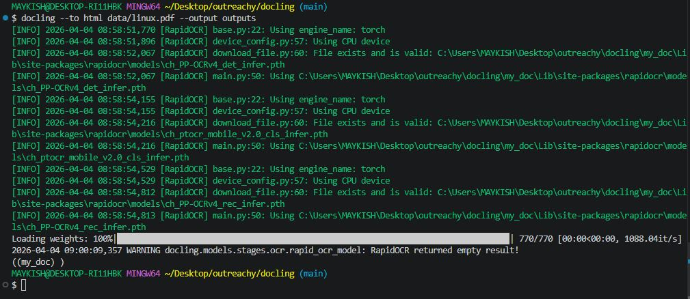
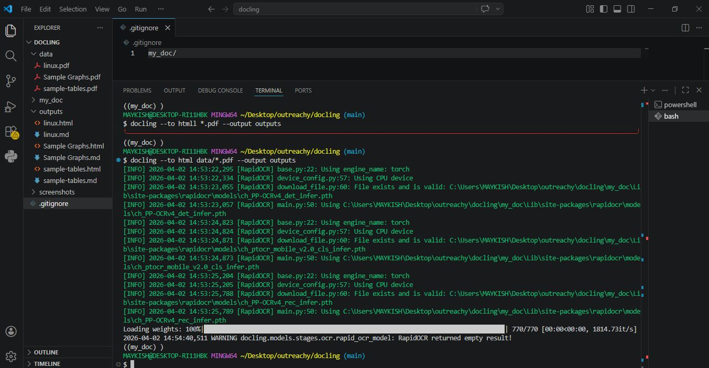
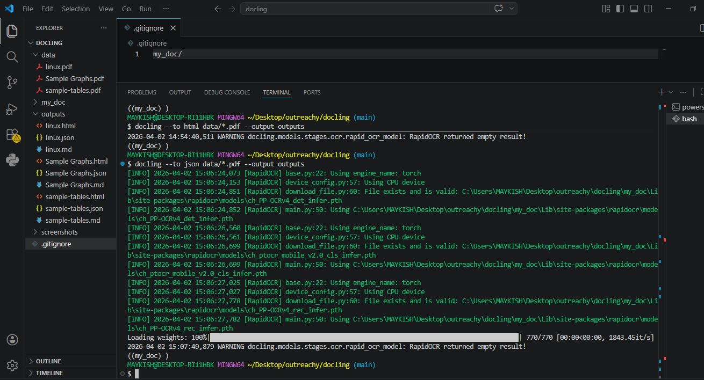
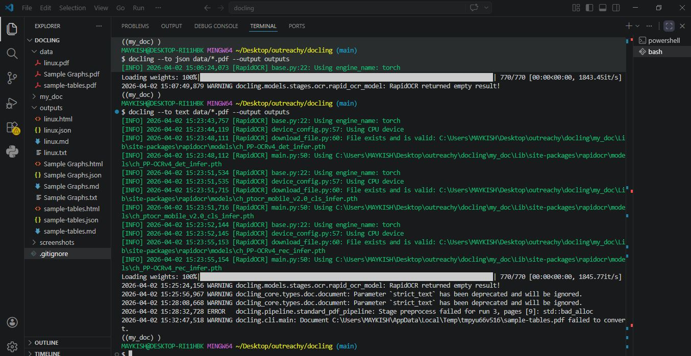
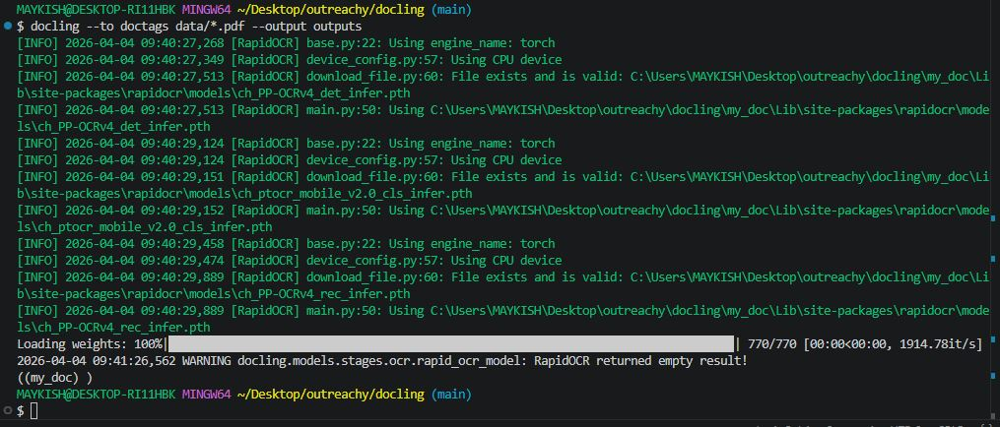
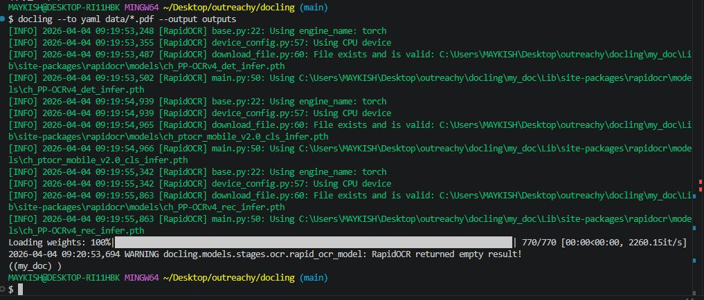
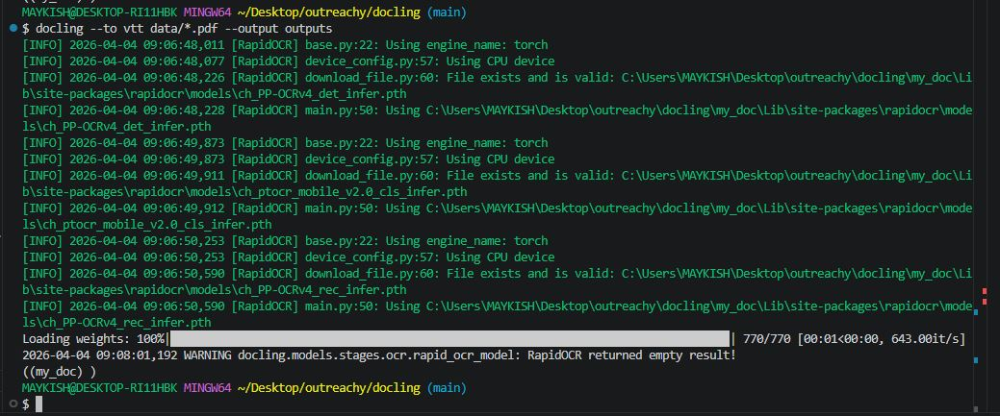

# Exploring Docling Open Source Basics

  * Tool name: Docling
  * Language used: Python
  * Organization: Fedora Project : March - April 2026 Outreachy Contribution

## Introduction
### What is Docling
Docling is an open-source document processing tool used to parse, convert, and structure content from documents such as PDFs into machine-readable formats like Markdown, HTML, YAML, and JSON and is commonly used in AI pipelines, such as Retrieval Augmented Generation (RAG), to prepare documents for downstream analysis and retrieval tasks.

### What is Docling CLI
Docling CLI is the command-line tool used to run Docling functions such as document conversion, format selection, and pipeline testing directly from  terminal.

## Objective
The objective of this task is to explore the basic functionality of Docling as an open-source document processing tool;

* Install Docling
* Verify installation
* Convert PDF documents
* Test different output formats
* Compare CLI options
* Analyse results

  1. ## Install Docling
Before installing Docling, I prepared a project workspace by navigating to the project directory, verifying the Python version, creating and activating a virtual environment, and organizing folders which are; data, outputs, and screenshots. This setup ensured a clean development environment and proper project structure:

 ## Environment Set-up 
 The virtual environment was created and activated before installing Docling.
 

  * Move to Desktop
     Move to where the project folder is located
    
                cd Desktop/

 * Navigate to outreachy folder
      Navigate to main project directory created for Outreachy tasks.
   
                cd outreachy/

* Navigate to docling project folder
      Move into the specific project directory where Docling exploration work is done.
  
                 cd docling

* Check Python version
      Confirmed Python is installed and checked compatibility (Docling requires Python 3.9+ typically)
      
                 python --version

* Create virtual environment
      Created an isolated Python environment named my_doc to avoid dependency conflicts.
      
                 python -m venv my_doc

 * Activate virtual environment
      Activated the virtual environment so packages install locally instead of globally.
      Everytime I use docling I activate virtual environment to find docling
      
                 source my_doc/Scripts/activate

* Created folders
       Created a directory to store terminal and output screenshots for documentation
  
                 mkdir screenshots

       Created folder to store input files/PDFs
  
                 mkdir data

       Created folder to store converted files Markdown, HTML, JSON, YAML, outputs.
  
                 mkdir outputs

       Displayed the created project structure
  
                 ls

## Docling Installation
After successfully seeting up the virtual environment and activated, the next step was to install Docling using pip. This ensures that all required dependencies are installed within the isolated project environment for better reproducibility and dependency management.
 

     pip install docling

  2. ## Verify installation
  After installing Docling, I verified that the installation was successful by checking the installed version:
  Shown in the image above

     docling --version

  3. ## Convert PDF documents

  ## Default PDF conversion
  The first test involved converting a standard PDF (linux.pdf) using the tool's most streamlined approach. Docling CLI default  conversion does not require the user to specify a format in the command. When no flags are provided, Docling automatically defaults to Markdown (.md), which is optimized for structured data extraction
  

 
 

       docling data/linux.pdf
  
  4. ## Test different output formats
  In addition to default conversion(.md format), I used the following commands to convert files and export the source files in the data/ directory to a dedicated outputs/ folder.

  * For a single file conversion I used the command below:
    
                  docling --to html data/linux.pdf --output outputs

       

       
       

  * For multiple files conversion I used the command below:
  
    - Standard web-based rendering and styling

                  docling --to html data/*.pdf --output outputs

       

       
       

    - Programmatic data processing with full metadata
   
                  docling --to json data/*.pdf --output outputs

       

       
       

    - Extraction for simple keyword indexing
   
                  docling --to text data/*.pdf --output outputs

      

       
       

    - Structural analysis of document elements
   
                  docling --to doctags data/*.pdf --output outputs

       

       
       

    - Highly readable structured data that is ideal for config-driven pipelines
   
                  docling --to yaml data/*.pdf --output outputs

       

       
       

    - Web Video Text Tracks; useful for time-aligned or indexed text segments

                  docling --to vtt data/*.pdf --output outputs
        

        
        

    - Generates separate HTML files for each page, which is critical for memory management in large documents
   
                  docling --to html_split_page data/*.pdf --output outputs

        

        
        

  
  5. ## Compare CLI options
  6. ## Analyse results
